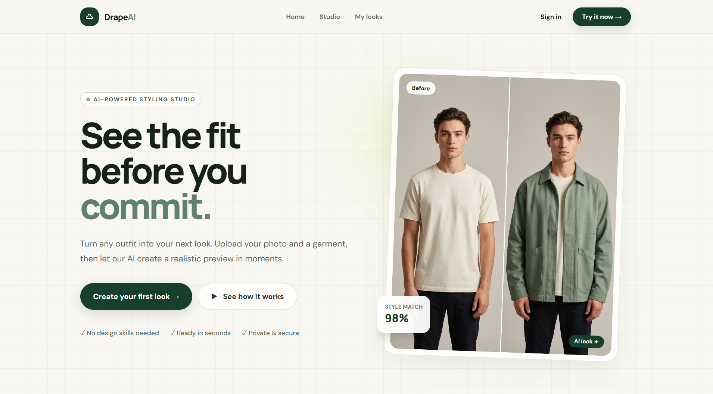

# AI Virtual Try-On

A production-ready AI Virtual Try-On platform where users can upload a person image and a clothing image, then generate a realistic image showing the person wearing the uploaded clothing.

## Preview

<p align="center">
  
</p>

## Tech Stack

**Frontend:**
- React + TypeScript
- Vite
- Tailwind CSS
- React Router
- Axios

**Backend:**
- NestJS + TypeScript
- Passport + JWT Authentication
- Cloudinary (image storage)
- Replicate API (AI generation)

**Shared:**
- TypeScript DTOs and enums

## Project Structure

```
AI-Virtual-Try-On/
├── frontend/                  # React frontend
│   ├── src/
│   │   ├── components/        # Reusable UI components
│   │   │   ├── ClothingCategorySelector.tsx
│   │   │   ├── ImageComparisonSlider.tsx
│   │   │   ├── ImageUpload.tsx
│   │   │   └── ZoomableImage.tsx
│   │   ├── lib/
│   │   │   └── api.ts         # Axios instance with interceptors
│   │   ├── pages/
│   │   │   ├── LandingPage.tsx
│   │   │   ├── UploadPage.tsx
│   │   │   ├── ResultPage.tsx
│   │   │   ├── LoginPage.tsx
│   │   │   ├── SignupPage.tsx
│   │   │   └── HistoryPage.tsx
│   │   ├── App.tsx
│   │   ├── main.tsx
│   │   └── index.css
│   ├── index.html
│   ├── vite.config.ts
│   ├── tailwind.config.js
│   └── tsconfig.json
├── backend/                   # NestJS backend
│   ├── src/
│   │   ├── ai/                # AI generation module
│   │   │   ├── providers/     # Pluggable AI provider system
│   │   │   │   ├── provider.interface.ts
│   │   │   │   └── replicate.provider.ts
│   │   │   ├── ai.controller.ts
│   │   │   ├── ai.module.ts
│   │   │   ├── ai.service.ts
│   │   │   └── generate-try-on.dto.ts
│   │   ├── auth/              # JWT authentication
│   │   │   ├── auth.controller.ts
│   │   │   ├── auth.dto.ts
│   │   │   ├── auth.guard.ts
│   │   │   ├── auth.module.ts
│   │   │   ├── auth.service.ts
│   │   │   ├── jwt.strategy.ts
│   │   │   └── user.service.ts
│   │   ├── cloudinary/        # Cloudinary integration
│   │   │   ├── cloudinary.module.ts
│   │   │   └── cloudinary.service.ts
│   │   ├── common/
│   │   │   ├── filters/       # Global exception filter
│   │   │   └── middleware/    # Security headers, rate limiting, logging
│   │   ├── history/           # Generation history
│   │   │   ├── generation-history.controller.ts
│   │   │   ├── generation-history.module.ts
│   │   │   └── generation-history.service.ts
│   │   ├── upload/            # Image upload
│   │   │   ├── upload.controller.ts
│   │   │   ├── upload.module.ts
│   │   │   └── upload.service.ts
│   │   ├── app.module.ts
│   │   └── main.ts
│   ├── nest-cli.json
│   └── tsconfig.json
├── shared/                    # Shared types and DTOs
│   ├── src/
│   │   ├── dto/
│   │   │   ├── clothing.dto.ts
│   │   │   └── index.ts
│   │   └── index.ts
│   └── tsconfig.json
├── .env.example
├── .gitignore
└── package.json               # Monorepo root (npm workspaces)
```

## Features

- **Image Upload** — Drag and drop with preview, file type validation (JPG/PNG), 10MB size limit
- **Clothing Selection** — Choose from Shirt, T-Shirt, Hoodie, Jacket, Suit, Dress
- **AI Generation** — Pluggable provider architecture (Replicate IDM-VTON)
- **Result Experience** — Before/after comparison slider, zoom support, side-by-side view
- **Authentication** — JWT-based signup/login, protected routes
- **Generation History** — View, download, and delete past generations
- **Error Handling** — Global exception filter, generation timeout, network error handling
- **Production Security** — Rate limiting, security headers, request logging, input validation

## Prerequisites

- **Node.js** v18+ (recommended: v20+)
- **npm** v9+
- **Cloudinary account** — for image storage
- **Replicate account** — for AI generation API

## Setup Instructions

### 1. Clone the repository

```bash
git clone https://github.com/im-alisher/AI-Virtual-Try-On.git
cd AI-Virtual-Try-On
```

### 2. Install dependencies

```bash
npm install
```

This installs dependencies for all workspaces (frontend, backend, shared) via npm workspaces.

### 3. Configure environment variables

Copy the example env file and fill in your credentials:

```bash
cp .env.example .env
```

Edit `.env` with your values:

```env
# Cloudinary (get from https://console.cloudinary.com)
CLOUDINARY_CLOUD_NAME=your_cloud_name
CLOUDINARY_API_KEY=your_api_key
CLOUDINARY_API_SECRET=your_api_secret

# Replicate (get from https://replicate.com/account/api-tokens)
REPLICATE_API_TOKEN=r8_your_token

# JWT Secret (any random string for development)
JWT_SECRET=your-super-secret-key

# Backend
BACKEND_PORT=3001
CORS_ORIGIN=http://localhost:5173

# Frontend
VITE_API_URL=http://localhost:3001
```

### 4. Build the shared package

```bash
npm run build --workspace=shared
```

### 5. Start development servers

Open two terminals:

**Terminal 1 — Backend:**
```bash
npm run dev:backend
```
Backend runs at `http://localhost:3001`

**Terminal 2 — Frontend:**
```bash
npm run dev:frontend
```
Frontend runs at `http://localhost:5173`

### 6. Open the app

Navigate to `http://localhost:5173` in your browser.

## How to Use

1. **Sign up** for an account at `/signup` (or skip — auth is optional)
2. **Go to Upload** page (`/upload`)
3. **Upload a person photo** — drag & drop or click (JPG/PNG, max 10MB)
4. **Upload a clothing image** — same format
5. **Select clothing type** — Shirt, T-Shirt, Hoodie, Jacket, Suit, or Dress
6. **Click "Generate Try-On"** — the system sends images to the AI provider
7. **Wait for generation** — polling checks status every 3 seconds
8. **View result** — use comparison slider, zoom, or side-by-side view
9. **Download** the result or generate a new one
10. **View history** at `/history` to see past generations

## API Endpoints

### Upload
| Method | Endpoint | Description |
|--------|----------|-------------|
| POST | `/api/upload/person` | Upload person image |
| POST | `/api/upload/clothing` | Upload clothing image |

### AI Generation
| Method | Endpoint | Description |
|--------|----------|-------------|
| POST | `/api/ai/generate` | Start try-on generation |
| GET | `/api/ai/status/:id` | Check generation status |

### Authentication
| Method | Endpoint | Description |
|--------|----------|-------------|
| POST | `/api/auth/signup` | Create account |
| POST | `/api/auth/login` | Login |
| GET | `/api/auth/profile` | Get profile (requires JWT) |

### History
| Method | Endpoint | Description |
|--------|----------|-------------|
| GET | `/api/history` | List generations (requires JWT) |
| DELETE | `/api/history/:id` | Delete generation (requires JWT) |

## Production Build

```bash
# Build everything
npm run build

# Or build individually
npm run build:shared
npm run build:frontend
npm run build:backend
```

Frontend output: `frontend/dist/`
Backend output: `backend/dist/`

## Available Scripts

| Command | Description |
|---------|-------------|
| `npm run dev:frontend` | Start frontend dev server |
| `npm run dev:backend` | Start backend dev server (watch mode) |
| `npm run build` | Build all packages |
| `npm run typecheck` | Type-check all packages |
| `npm run lint` | Lint all packages |

## Architecture Notes

### AI Provider System

The backend uses a pluggable provider architecture:

```typescript
// backend/src/ai/providers/provider.interface.ts
export interface VirtualTryOnProvider {
  readonly name: string;
  generate(params: GenerateTryOnParams): Promise<TryOnGenerationResult>;
  getStatus(id: string): Promise<TryOnGenerationResult>;
}
```

To add a new AI provider:
1. Create a new file in `backend/src/ai/providers/`
2. Implement the `VirtualTryOnProvider` interface
3. Register it in `backend/src/ai/ai.module.ts` by changing the provider injection

### Generation Flow

```
User uploads images → Cloudinary stores them → AI provider receives URLs
→ Backend polls provider status every 3s → Frontend polls backend every 3s
→ Result displayed with comparison slider
```

## License

MIT
